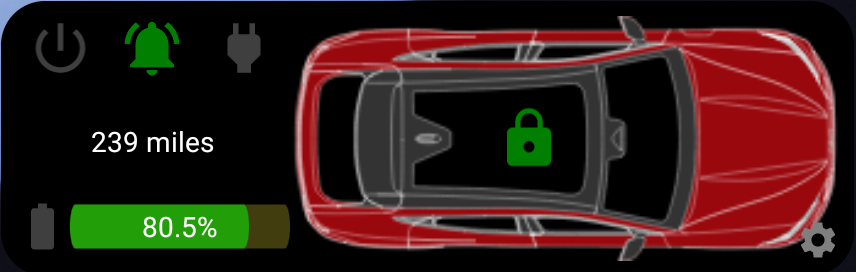

# Ford Status (formerly Mustang Mach-E) Widget for Android

 

## Intro

This app/widget is based on the work of [Anthony (tonesto7)](https://github.com/tonesto7), which is in turn based on the earlier work of 
[David Schablowsky](https://github.com/dschablowsky/FordPassWidget), and also the work of [@DevSecOps](https://www.macheforum.com/site/threads/guide-android-mme-widget-more-complex.13588/)
.  It is not a complete implementation of the functionality of their widgets, as it:
- is designed for the Ford Mustang Mach-E, but capabilities have been extended to support 
  F-150/F-250/F-350, Ranger, Maverick, Bronco/Bronco Sport, Explorer, Escape, Edge, Expedition, Mustang, Kuga, Puma,
  and European Focus vehicles (owner feedback on functionality is encouraged)
- does not include all the function of tonesto7's Apple/iOS widget
- does not currently support accounts outside of the United States, although it may still work

  
  
  

My purpose for hosting this code on GitHub under the GPL v3 license is to provide a starting point for anyone who wants to extend its functionality.

## Installation

Search for "Ford Status Widget" on the Google Play store, or download 
this [app-release.apk](https://github.com/khpylon/MachEWidget/blob/master/app/github/release/app-release.apk?raw=true) file and sideload on your Android device.

## Requirements

- Android 9 through 13 (may work on earlier Android versions, but not tested)
- [FordPass account](https://sso.ci.ford.com/authsvc/mtfim/sps/authsvc?PolicyId=urn:ibm:security:authentication:asf:basicldapuser&Target=https%3A%2F%2Fsso.ci.ford.com%2Foidc%2Fendpoint%2Fdefault%2Fauthorize%3FqsId%3D1f0281db-c684-454a-8d31-0c0f297cc9ed%26client_id%3D880cf418-6345-4e3b-81cd-7b623309b571&identity_source_id=75d08ad1-510f-468a-b69b-5ebc34f773e3#appID=CCCA9FB8-B941-46AD-A89F-F9D9D699DD68&propertySpecificContentKey=brand_ford&originURL=https%3A%2F%2Fwww.ford.com%2F&lang=en_us&fsURL=https%3A%2F%2Fapi.mps.ford.com) (has to be working with FordPass app, and NOT MyFord Mobile)

## Features

- Will automatically fetch data from servers (default is every 15 minutes, but configurable)
- Send commands to car to lock or unlock doors, perform remote start, and force refresh
- Assign "short cuts" to other related apps such as FordPass, Waze, etc
- Can display all supported vehicles assigned to a single log-in on individual widgets
- Display vehicles as a wireframe or in color

## Known Issues & Limitations

- Does not include all the function of tonesto7's Apple/iOS widget
- Is not guaranteed to support accounts outside of the United States
- Currently does not show OTA information, as Ford's API changed

## Contributing Help for Unsupported Vehicles

If you would like to use the app but your vehicle is not currently supported, there are a few things you can do:

1. Load the app onto your phone and gather log data about your vehicle.  See the "Bug Report" section for how to gather log data.  The important piece of data is the JSON responses for car status.
2. Consider contributing the necessary graphics for your vehicle.  Free drawings would be great (provided they are usable and *actually free*), but chipping in a donation towards the purchase of SVG CAD drawings is also encouraged.
3. Encourage fellow owners to do the same.

## Bug Reports

If you discover something which doesn't work the way you expect, check first on the forums to see whether someone else has
reported a similar problem (or whether the app is actual working properly).  Also search under
["Issues"](https://github.com/khpylon/MachEWidget/issues) on GitHub to see if it's been reported.  If not, you will need to gather
some data to create a new bug report.  

The app has some built-in support for gathering log information:

1. Under "Settings", activate "Enable logging"
2. Perform any actions you think will demonstrate the issue
3. Under the three-dot menu, select "Save logfile"; this will save a file named *fsw_logfile-<datetime>.txt* or something similar in the *Downloads* folder of your
external storage
4. Deactivate "Enable logging"
5. Create/append to an Issue and upload the file as an attachment

A serious bug that causes the app to crash will dump some information to logcat.  The app will check for this the next time it is run
and write it to a file named *fsw_logcat-<datetime>.txt* in your *Downloads* folder.  You can then post this with a new issue on GitHub.

## Frequently Asked Questions

Refer to the [FAQ](https://github.com/khpylon/MachEWidget/blob/master/FAQ.md) file.  It's a work in progress.  If your questions isn't there, ask on the forums or 
send a message to suggest adding it.

## Donations

This project is free to use and free for anyone to copy, but there occasionally are some costs for the content it uses.  If you are interested in supporting
development, use the Paypal or BuyMeACoffee links at the top of the page.  Any funds not spent on the project will be donated to charity.

## Credits

Thanks to [tonesto7](https://github.com/tonesto7/fordpass-scriptable) for his work on the new widget, and to
[dschablowsky](https://github.com/dschablowsky/FordPassWidget) for his work on the original widget, 
[d4v3y0rk](https://github.com/d4v3y0rk) for finding out the information about the Ford api.
Thanks to [@DevSecOps](https://www.macheforum.com/site/members/devsecops.7076/) on the [Mach-E Forums](https://www.macheforum.com/site/) 
for his valuable input and help with updating the appearance of the widget and permitting the use of the assets from his app.
Additional thanks to [marco79cgn](https://github.com/marco79cgn) and [Tobias Battenberg](https://github.com/mountbatt) for your widgets.  Also, thanks to those
who have funded the project via PayPal so that I have funds to purchase additional resources to further enhance the app.

The [ColorPickerView](https://github.com/skydoves/ColorPickerView) was written by skydoves (Jawwoong Eum), and copyrighted 2017 under the [Apache Licence, Version 2.0]
(https://github.com/skydoves/ColorPickerView#license).

A number of the icons used in this app are derived from free ones found on [Icon8](https://icons8.com/); thanks to the original creators.

## Disclaimer

I was inspired to create this app for Android in order to see more information about my vehicle, and to learn new things about Android programming.
I am not employed by Ford, and this app is not supported by Ford. 
Ford's API may be changed at any time, rendering the app unusable. 
I am NOT liable for any kind of damage (special, direct, indirect, consequential or whatsoever) resulting from the use of this app. 

## License

This code is released as open source software under the GPL v3 license: see the [LICENSE](https://github.com/khpylon/MachEWidget/LICENSE.txt) file in the project root for the full license text.
