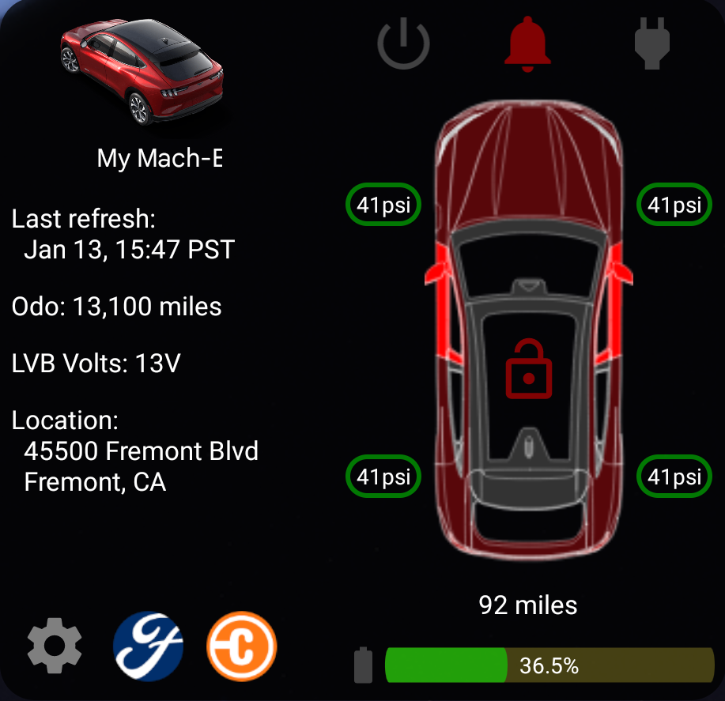

# Mustang Mach-E Widget for Android

## Intro

This app/widget is based on the work of [Anthony (tonesto7)](https://github.com/tonesto7), which is in turn based on the earlier work of 
[David Schablowsky](https://github.com/dschablowsky/FordPassWidget), and also the work of [@DevSecOps](https://www.macheforum.com/site/threads/guide-android-mme-widget-more-complex.13588/)
.  It is not a complete implementation of the functionality of their widgets, as it:
- is only intended for the Ford Mustang Mach-E, as that's the only Ford I own
- does not include all the function of tonesto7's Apple/iOS widget
- does not currently support accounts outside of the United States, although it may still work

My purpose for hosting this code on GitHub under the GPL v3 license is to provide a starting point for anyone who wants to extend its functionality.

## Downloads

Download the [app-release.apk](https://github.com/khpylon/MachEWidget/blob/master/app/release/app-release.apk?raw=true) file and sideload on your Android device.

## Requirements

- Android 10, 11, or 12 (may work on earlier Android versions, but not tested)
- [FordPass account](https://sso.ci.ford.com/authsvc/mtfim/sps/authsvc?PolicyId=urn:ibm:security:authentication:asf:basicldapuser&Target=https%3A%2F%2Fsso.ci.ford.com%2Foidc%2Fendpoint%2Fdefault%2Fauthorize%3FqsId%3D1f0281db-c684-454a-8d31-0c0f297cc9ed%26client_id%3D880cf418-6345-4e3b-81cd-7b623309b571&identity_source_id=75d08ad1-510f-468a-b69b-5ebc34f773e3#appID=CCCA9FB8-B941-46AD-A89F-F9D9D699DD68&propertySpecificContentKey=brand_ford&originURL=https%3A%2F%2Fwww.ford.com%2F&lang=en_us&fsURL=https%3A%2F%2Fapi.mps.ford.com) (has to be working with FordPass app, and NOT MyFord Mobile)

## Features

- Will automatically fetch data from servers (default is every 10 minutes, but configurable)
- Shows recent OTA information

## Known Issues & Limitations

As listed above, this app
- is only intended for the Ford Mustang Mach-E, as that's the only FOrd I own
- does not include all the function of tonesto7's Apple/iOS widget
- is not guaranteed to support accounts outside of the United States

## To do

- Display information using more graphics and less text where possible. 

## Credits

Thanks to [tonesto7](https://github.com/tonesto7/fordpass-scriptable) for his work on the new widget, and to
[dschablowsky](https://github.com/dschablowsky/FordPassWidget) for his work on the original widget, 
[d4v3y0rk](https://github.com/d4v3y0rk) for finding out the information about the ford api.
Thanks to [@DevSecOps](https://www.macheforum.com/site/members/devsecops.7076/) for on the [Mach-E Forums](https://www.macheforum.com/site/) 
for his valuable input and help with updating the appearace of the widget and the premitting the use of the assets from his app.
Additional thanks to [marco79cgn](https://github.com/marco79cgn) and [Tobias Battenberg](https://github.com/mountbatt) for your widgets.

A number of the icons used in this app are derived from free ones found on [Icon8](https://icons8.com/); thanks to the original creators.

## Disclaimer

I was inspired to create this app for Android in order to see more information about my vehicle, and to learn new things about Android programming.
I am not employed by Ford, and this app is not supported by Ford. 
The API used can be changed at any time by Ford. 
I am NOT liable for any kind of damage (special, direct, indirect, consequential or whatsoever) resulting from the use of 
this app. 

## License

This code is released as open source software under the GPL v3 license: see the [LICENSE](https://github.com/khpylon/MachEWidget/LICENSE.txt) file in the project root for the full license text.
